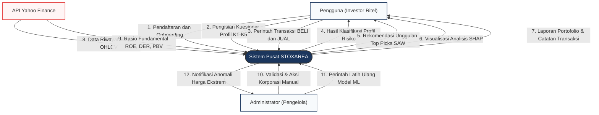
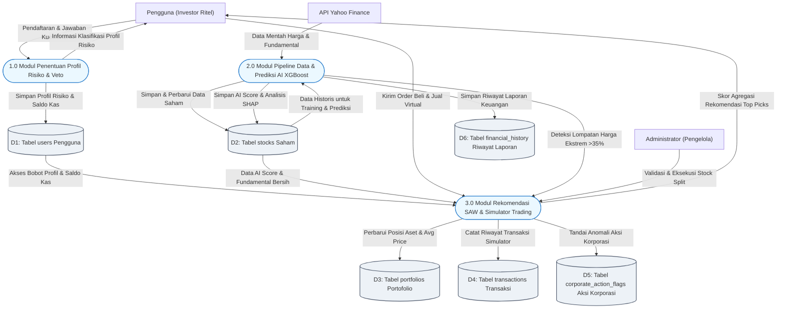
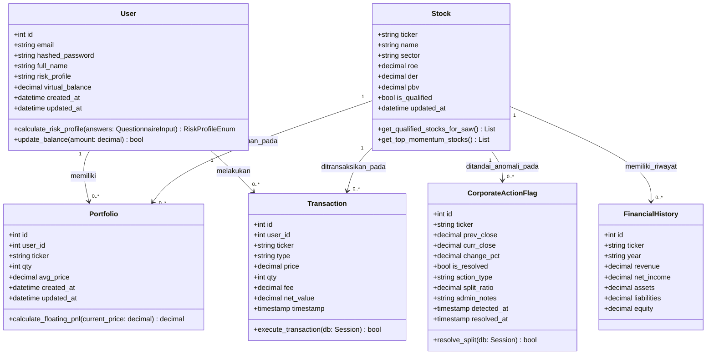
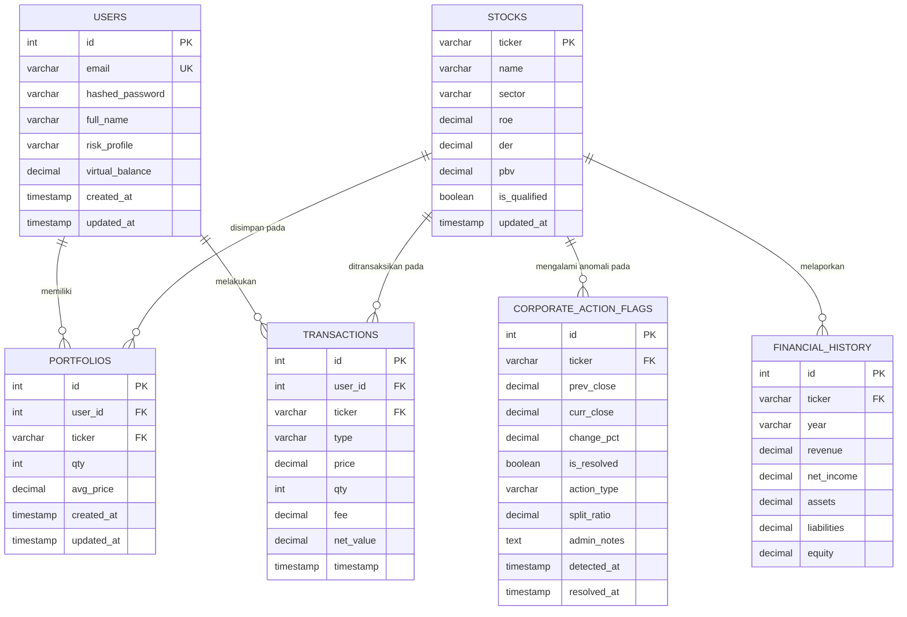

# Dokumen Rancangan Diagram Sistem: STOXAREA

Dokumen ini memuat spesifikasi rancangan diagram alir data (DFD Level 0 & Level 1), Diagram Kelas UML, dan Entity Relationship Diagram (ERD) untuk sistem **STOXAREA**. Diagram-diagram di bawah ini ditulis menggunakan sintaksis **Mermaid** dengan seluruh penjelasan dan alur hubungan dalam **Bahasa Indonesia**.

---

## 1. DFD Level 0 (Diagram Konteks)

DFD Level 0 (Diagram Konteks) menggambarkan batas sistem **STOXAREA** secara eksternal, memperlihatkan entitas luar yang berinteraksi dengan sistem, serta arus data utama masuk dan keluar sistem.

---

## 2. DFD Level 1 (Diagram Dekomposisi Modul)

DFD Level 1 mendekomposisi proses utama sistem STOXAREA menjadi **3 modul operasional teragregasi** yang berinteraksi secara aktif dengan penyimpanan data database (*Data Stores*).

---

## 3. Diagram Kelas UML (UML Class Diagram)

Diagram Kelas UML di bawah ini menggambarkan pemodelan kelas pemrograman (*OOP Class Models*) pada kode backend, lengkap dengan nama relasi asosiasi dalam **Bahasa Indonesia**.

---

## 4. Entity Relationship Diagram (ERD)

ERD di bawah ini memodelkan struktur penyimpanan data relasional pada database PostgreSQL dengan menerapkan aturan kunci (*Primary Key*, *Foreign Key*) serta derajat kardinalitas dan relasi dalam **Bahasa Indonesia**.

